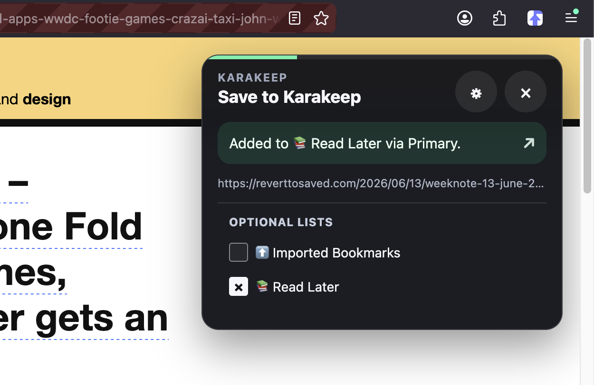

# Danvers Karakeep Extension

**Version:** [<!-- version -->1.0.0<!-- /version -->](https://github.com/L-K-M/Danvers/releases/latest)

Danvers is an alternative Karakeep browser extension mainly aimed at mobile Firefox-based browsers like Iceraven.



> [!IMPORTANT]
> LLM Disclosure: This project was developed with the assistance of large language models (AI coding tools).

## Setup

0. Install the extension in your browser (see "Permanent Installation" below).
1. Open the extension settings page.
2. Set your primary Karakeep server URL. This can be the local Wi-Fi address of your Karakeep instance.
3. Optionally set a secondary Karakeep server URL. This can be a Tailscale or public address used when the primary address is unavailable.
4. Paste a Karakeep API token.
5. Use `Test Connection` to verify the token and load editable Lists.
6. Optionally choose a default List.
7. Leave `Send the page content with the bookmark` enabled unless you want link-only saves (see below).
8. Choose where the inline popup appears: top left, top right, bottom left, or bottom right.
9. Configure how many seconds the success panel remains visible before auto-closing.

## Sending page content

By default Danvers uploads the page as your browser rendered it, so Karakeep does not have to fetch the URL itself. This keeps pages readable that a server-side crawl cannot reach: captcha and bot-check walls, cookie banners, and anything behind a login you are already signed in to.

Mechanically, Danvers serializes the live DOM (scripts stripped, a `<base>` tag pinned so relative links and images still resolve), uploads it to `POST /api/assets`, and passes the returned asset id to Karakeep as `precrawledArchiveId`. Karakeep's crawler then parses that archive instead of requesting the URL.

The save degrades rather than fails. If the capture or the upload does not work — the page is larger than 5 MB, the server rejects the asset, the connection drops — Danvers saves the plain link and the success panel says why the content was not sent. Turning the setting off saves the link alone and lets Karakeep crawl as before.

Because an asset id is only valid on the server that stored it, the bookmark is always created on whichever server accepted the upload. If that server becomes unreachable in between, Danvers falls back to a link-only save rather than attaching an id the other server does not know.

Danvers always tries the primary server first. If the primary request fails because the server cannot be reached or returns a server-side error, it retries the same request against the secondary server. Authentication and validation errors do not fall back because the same token/request is expected to fail on both addresses.

If you use an `http://` local address, enable `Allow HTTP server URLs for local/self-hosted testing`. Firefox/Iceraven may also prompt for permission to connect to the configured origin when you save settings or test the connection.

## Build

The tooling is [`web-ext`](https://extensionworkshop.com/documentation/develop/web-ext-command-reference/), Mozilla's official command-line tool, driven through `npm` scripts. Install it once:

```bash
npm install
```

Then:

```bash
npm run lint     # validate the manifest and sources (web-ext lint)
npm run build    # package an unsigned .zip into web-ext-artifacts/
npm run start    # run the add-on in a temporary Firefox profile (web-ext run)
```

`npm run build` writes a version-stamped archive, e.g. `web-ext-artifacts/danvers-0.9.0.zip`, containing only the runtime files (`manifest.json`, `src/`, `icons/`, `README.md`, `LICENSE`).

## Temporary Installation

Desktop Firefox:

1. Open `about:debugging#/runtime/this-firefox`.
2. Choose `Load Temporary Add-on...`.
3. Select `manifest.json` from this repository.

Iceraven:

1. Package the repository as a `.zip` or `.xpi` containing `manifest.json` at the archive root.
2. Install it using Iceraven's extension/developer workflow for local add-ons.
3. Configure the extension settings before saving pages.

## Permanent Installation

Before signing, set `browser_specific_settings.gecko.id` in `manifest.json` to a unique add-on id that you control.

For permanent Firefox/Iceraven installation, the extension must be signed by Mozilla.

Create or use a Mozilla Add-ons developer account, then generate API credentials at:

```text
https://addons.mozilla.org/en-US/developers/addon/api/key/
```

Export your AMO credentials and sign:

```bash
export WEB_EXT_API_KEY="your-jwt-issuer"
export WEB_EXT_API_SECRET="your-jwt-secret"
npm run sign
```

This writes a signed `.xpi` to `web-ext-artifacts/`. The same signing happens automatically in CI when a `v*` tag is pushed and the `AMO_JWT_ISSUER` / `AMO_JWT_SECRET` repository secrets are configured — see [CICD.md](CICD.md).

## Releases

Releases are cut by pushing a version tag. The shared [release tool](https://github.com/L-K-M/release-tool) does it in one step:

```bash
scripts/release.sh 1.2.3 --push     # bump manifest.json, commit, tag v1.2.3, and push
```

Pushing the `v*` tag triggers [`.github/workflows/release.yml`](.github/workflows/release.yml), which verifies the tag matches `manifest.json`, packages the extension with `web-ext` (signing through Mozilla Add-ons when the AMO secrets are set, otherwise an unsigned `.zip`), and publishes a GitHub Release with auto-generated notes. Every pull request and push to `main` is linted by [`.github/workflows/ci.yml`](.github/workflows/ci.yml). The `<!-- version -->` marker near the top of this file is kept in step by the release tool. See [CICD.md](CICD.md) for the full pipeline.
